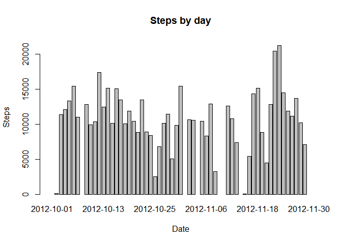
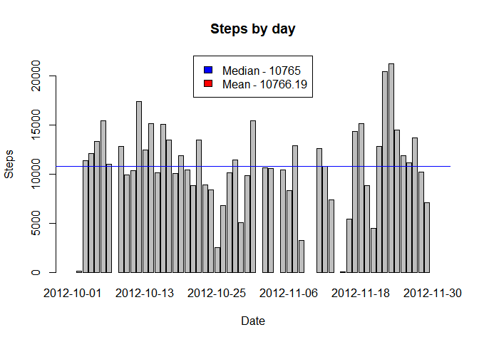
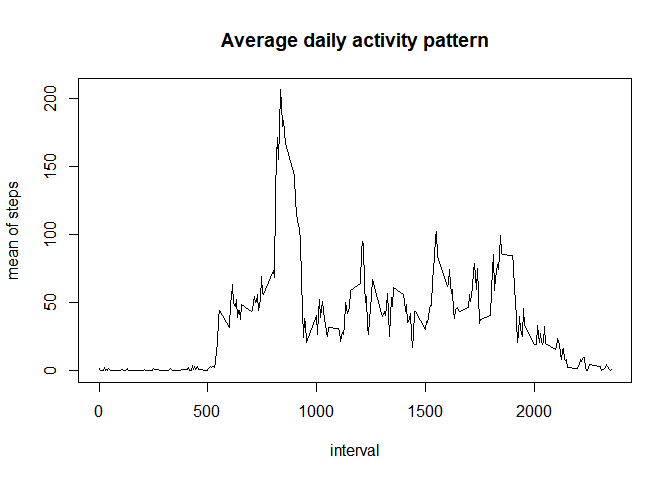
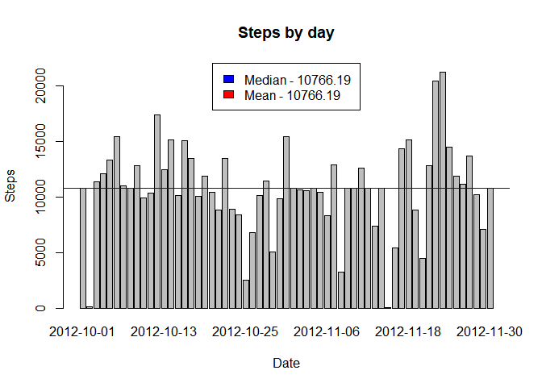
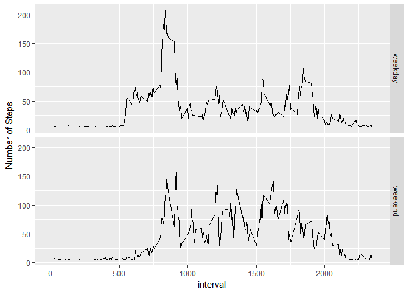

### Set Working directory and read the DataSet

    setwd("~/Data_Scientist/Reproducible Research/RepData_PeerAssessment1")

    unzip ("activity.zip") # extracts the content of the zip file

    activity <- read.csv("activity.csv") # loads the dataset

### What is mean total number of steps taken per day?

1 Make a histogram of the total number of steps taken each day

    steps_by_day <- aggregate(activity$steps, by=list(date=activity$date), sum)
    max(steps_by_day$x, na.rm = TRUE)## highest value

    ## [1] 21194

    barplot(height=steps_by_day$x, names.arg=steps_by_day$date, xlab="Date", ylim=c(0,22000), ylab="Steps", main = "Steps by day")

2 Calculate and report the mean and median total number of steps taken
per day

    mean_steps_by_day <- mean(steps_by_day$x, na.rm = TRUE)
    median_steps_by_day <- median(steps_by_day$x, na.rm = TRUE)
    barplot(height=steps_by_day$x, names.arg=steps_by_day$date, xlab="Date", 
            ylim=c(0,22000), ylab="Steps", main = "Steps by day")
    abline(h = mean_steps_by_day, col = "red")
    abline(h = median_steps_by_day, col = "blue")
    legend("top", 
           legend = c("Median - 10765 ", "Mean - 10766.19"), 
           fill = c("blue", "red"))

### What is the average daily activity pattern?

Make a time series plot (i.e. type = "l") of the 5-minute interval
(x-axis) and the average number of steps taken, averaged across all days
(y-axis)

    steps_by_interval <- aggregate(steps ~ interval, data = activity, FUN = mean)
    plot(steps_by_interval$interval, steps_by_interval$steps, type="l", xlab="interval", ylab="mean of steps", 
           main="Average daily activity pattern")

Which 5-minute interval, on average across all the days in the dataset,
contains the maximum number of steps?

    maxSteps <- steps_by_interval$interval[which.max(steps_by_interval$steps)]
    maxSteps

    ## [1] 835

### Imputing missing values

Note that there are a number of days/intervals where there are missing
values (coded as NA). The presence of missing days may introduce bias
into some calculations or summaries of the data.

Calculate and report the total number of missing values in the dataset
(i.e. the total number of rows with NAs)

    sum(is.na(activity))

    ## [1] 2304

Devise a strategy for filling in all of the missing values in the
dataset. The strategy does not need to be sophisticated. For example,
you could use the mean/median for that day, or the mean for that
5-minute interval, etc.

Create a new dataset that is equal to the original dataset but with the
missing data filled in.

    #Replacing NAs with the mean of each day
    activity_na <- activity
    activity_na[is.na(activity)]=mean(activity$steps, na.rm=TRUE)
    # head(activity_na)
    # activity_na
    #which (is.na(activity_na))

    group_by_date_days_na <- aggregate(activity_na$steps, by=list(activity_na$date), FUN=sum)
    group_by_date_days_mean_na <- aggregate(activity_na$steps, by=list(activity_na$date), FUN=mean)
    group_by_date_days_median_na <- aggregate(activity_na$steps, by=list(activity_na$date), FUN=median)
    colnames(group_by_date_days_na) <- c("date", "total_steps")
    colnames(group_by_date_days_mean_na) <- c("date", "steps_mean")
    colnames(group_by_date_days_median_na) <- c("date", "steps_median")
    # group_by_date_days_mean_na
    # group_by_date_days_na
    # group_by_date_days_median_na

Make a histogram of the total number of steps taken each day and
Calculate and report the mean and median total number of steps taken per
day. Do these values differ from the estimates from the first part of
the assignment? What is the impact of imputing missing data on the
estimates of the total daily number of steps?

    #group_by_date_days_na$date <- as.numeric(group_by_date_days_na$date)

    barplot(group_by_date_days_na$total_steps, names.arg=group_by_date_days_na$date, xlab="Date", 
            ylim=c(0,22000), ylab="Steps", main = "Steps by day")
    abline(h = mean(group_by_date_days_na$total_steps), col = "red")
    abline(h = median(group_by_date_days_na$total_steps), col = "blue")
    legend("top", 
           legend = c("Median - 10766.19 ", "Mean - 10766.19"), 
           fill = c("blue", "red"))

### Are there differences in activity patterns between weekdays and weekends?

For this part the weekdays() function may be of some help here. Use the
dataset with the filled-in missing values for this part.

Create a new factor variable in the dataset with two levels - "weekday"
and "weekend" indicating whether a given date is a weekday or weekend
day.

    activity_na$day <- weekdays(as.Date(activity_na$date))
    activity_na$weekend <- ifelse(activity_na$day == "sábado" | activity_na$day == "domingo","weekend", "weekday")

    activity_na_weekend <- aggregate(activity_na$steps, by=list(activity_na$weekend , activity_na$interval), FUN=mean)
    colnames(activity_na_weekend) <- c("weekday" , "interval", "steps")
    library(ggplot2)

    ## Warning: package 'ggplot2' was built under R version 3.4.4

    ggplot(activity_na_weekend, aes(x = interval, y = steps)) + ylab("Number of Steps") + geom_line() + facet_grid(weekday~.)

